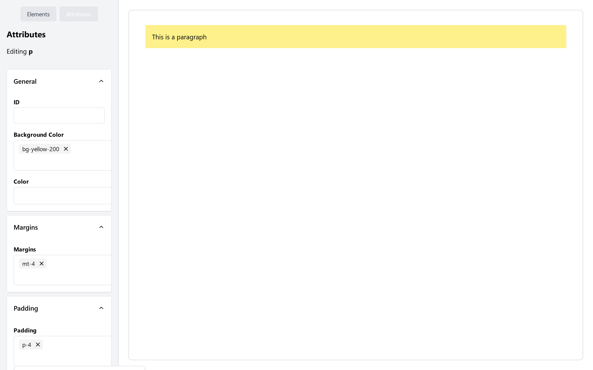

# vue-page-editor

> [!WARNING]  
> This project is still in development and not ready for production.

A page builder built on Vue 3 and Tailwind CSS.

## Features

- Drag and drop components

## Screenshot



## Contributing

Feel free to contribute to this project by creating a pull request or opening an issue.

## Project Setup

```sh
npm install
```

### Compile and Hot-Reload for Development

```sh
npm run dev
```

### Type-Check, Compile and Minify for Production

```sh
npm run build
```

## License

This project is licensed under the MIT License - see the [LICENSE](LICENSE) file for details.
